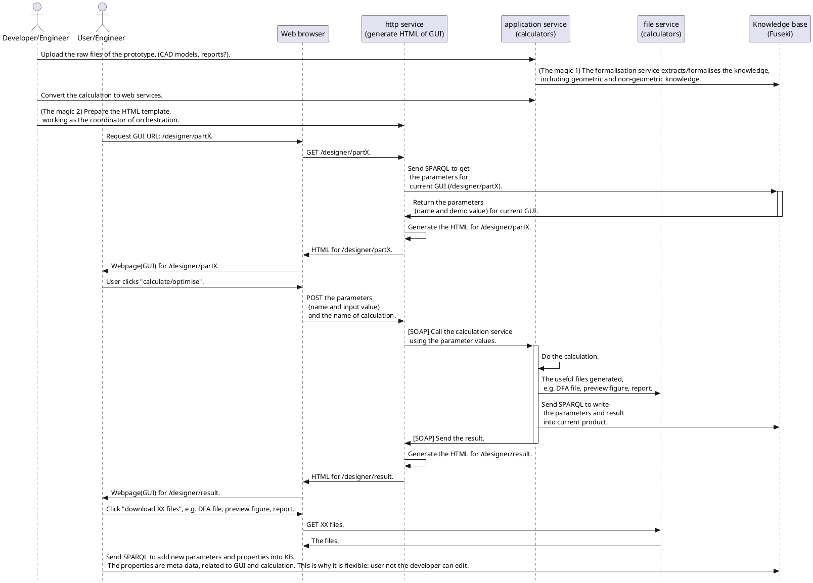
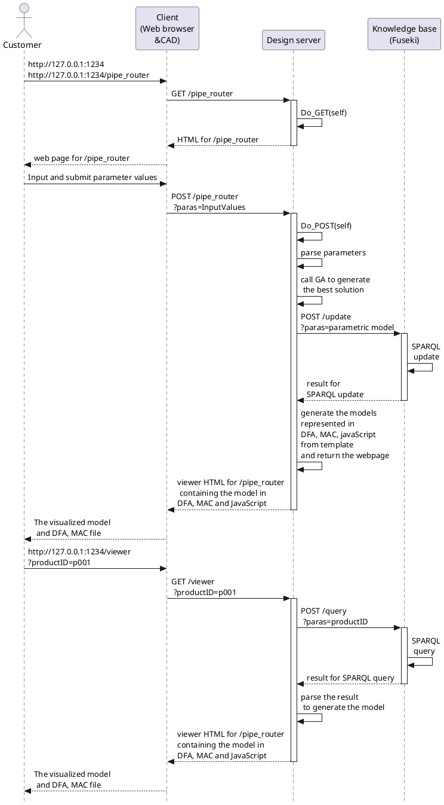

---
date: "2022-08-08"
tags: ["2022-08"]
title: "A low-code KBE framework"
toc: true
----

# A low-code KBE framework

## Some reference
The low code webinar and a brochure.
How the Composable Enterprise Will Accelerate Digital Transformation in the Automotive Industry[EB/OL]//Mendix. [2022-08-30]. https://www.mendix.com/resources/how-the-composable-enterprise-will-accelerate-digital-transformation-in-the-automotive-industry/.

### Digitalisation personnel
Gartner reports that 
- business technologists—employees who report outside of IT departments and create technology or analytics capabilities for work—now make up ==41%== of digital technologists.
- Another ==49%== are technology end users, 
- leaving only ==10%== inside the IT department.

### How does the manufacturing team create its personalized application? 

The low-code platform provides assembly tools for this task: 
- ==Templates== are prepackaged frameworks that provide a starting point for the application. In a few simple visual steps, the template can be customized to address a specific need. 
- ==App services== provide domain-specific building blocks packaged in cloud services. 
- ==Integrations== enable users to reach specific data and pull it into a workflow or experience.

## The purpose
A low-code framwwork to automate the design process as much as possible, e.g.:
- rapid generate the variants of series products,
- integrate different tools,
- rapid generate the secondary components after the main components are determined,
- ...

## Some expected features
- Flexible GUI, or low-code coordinator of orchestration
- SOA for integration of different tools
- Knowledge base for unified data storage
- ...

## What knowledge to capture?
Before writing the application, what do the engineers have?
These are called raw files:
- the CAD model files (DFA file), 
- some calaculation (excel, matlab/python scripts), 
- CAE model files (Ansys, abaqus),
- some design reports.

Geometric and non-geometric knowledge are contained in the raw files.

## How to formalize? What does the knowledge in KB look like?
Make the knowledge in those files **semantic**.
Maybe organised/ classified by sub-system or working group.
The knowledge is connected to each component.

## Some assumptions
- the CAD models are established in parametric formats, e.g. DFA file.
- the non-geometric parameters are stored in reports or ?

## The difficulties
1. The magic 1
- How to formalise the knowledge in raw files.
    - The parameters:
        - the geometric parameters in CAD files
        - the non-geometric parameters in reports ?
    - The rules(calculation) used to determine the parameters.
- What forms are the knowledge stored? Or how to organise the knowledge?
    [[# How to formalise? What does the knowledge in KB look like?]]

2. The magic 2
- How do the users use this application? How does the application interact with the user?

## The architecture
https://app.diagrams.net/#G1xU_qLjZD-mErccbckfeYHtZaPTjxmR3K

## The UML sequence diagram

--------------------
- The order making scenario

